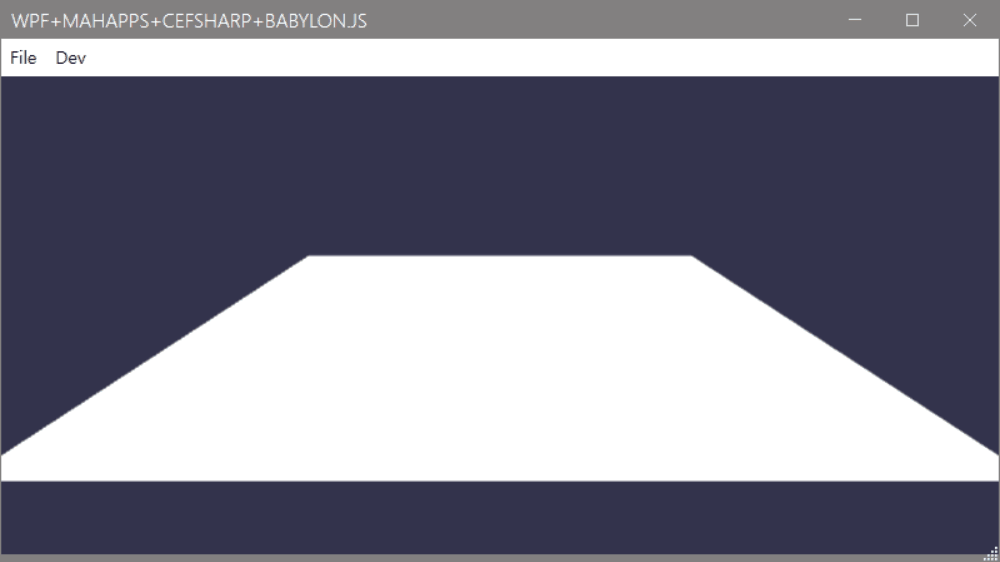

# wpfbabylon sample
 

<h1>requirements</h1>
- Node.js: v12.18.2 
- .Net Framework 4.7.2

<h1>how to run</h1>
1. open <b>'babylon_bundling'</b> directory in terminal. 
2. type <b>'npm install'</b> 
3. type <b>'npm run build'</b> 
4. open <b>wpfbabylon.sln</b> 
5. build solution. 
6. run